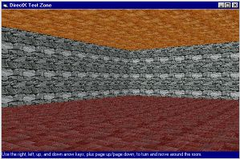



## DirectX Room Example \(Retained Mode\)

### Description

Displays a 3D room with textures and lights, and lets the user move around in it. Uses DirectX Retained Mode.
 
### More Info
 
Requires DirectX3 or higher, and Patrice Scribe's DirectX3 type library at <a href="http://members.xoom.com/vba51/downloads/directx.zip">http://members.xoom.com/vba51/downloads/directx.zip</a>.

Compatible with DirectX3 through DirectX7.

This Direct3D retained mode example originally came from Patrice Scribe's DirectX site. It was an example that almost worked, but the room was not resizable, and the texture on the floor was screwed up. I modified it to create a room any size, keeping the textures intact.

I was very excited while working on this, but ultimately dropped it due to lack of high color support. If ANYone can get this sample to use high color, drop me a line at kamilche@mad.scientist.com!

             |
---                |---
**Submitted On**   |2000-06-25 13:18:50
**By**             |[Kamilche](https://github.com/Planet-Source-Code/PSCIndex/blob/master/ByAuthor/kamilche.md)
**Level**          |Intermediate
**User Rating**    |5.0 (15 globes from 3 users)
**Compatibility**  |VB 3\.0, VB 4\.0 \(16\-bit\), VB 4\.0 \(32\-bit\), VB 5\.0, VB 6\.0, VB Script, ASP \(Active Server Pages\) 
**Category**       |[DirectX](https://github.com/Planet-Source-Code/PSCIndex/blob/master/ByCategory/directx__1-44.md)
**World**          |[Visual Basic](https://github.com/Planet-Source-Code/PSCIndex/blob/master/ByWorld/visual-basic.md)
**Archive File**   |[CODE\_UPLOAD71526252000\.zip](https://github.com/Planet-Source-Code/kamilche-directx-room-example-retained-mode__1-9256/archive/master.zip)

